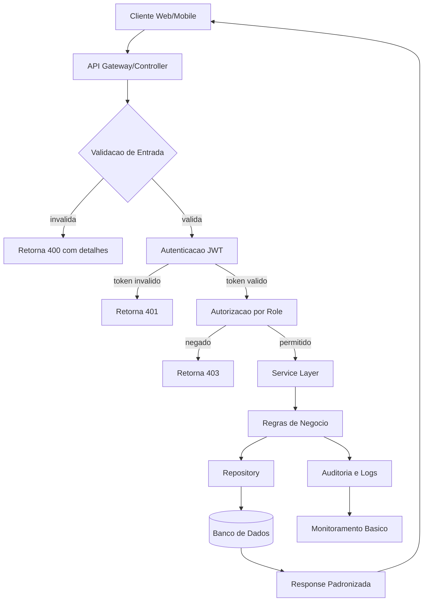

  

<h3 align="center">Backend Developer em formacao com foco em arquitetura de sistemas, APIs seguras e analise tecnica de requisitos</h3>

  
  
  

---

## 1) Header

Construo servicos backend e APIs REST para fluxos de negocio que exigem previsibilidade, seguranca basica e manutencao clara.

Como marca de engenharia, **Cinco** representa estrutura tecnica, decisoes orientadas por requisitos e foco em entrega funcional.

---

## 2) Sobre Mim

Sou **Adilson Junior (Cinco)**, com atuacao em formacao voltada para backend. Meu foco principal e projetar e implementar APIs REST com Java/Spring Boot e Node.js.

O que eu construo:
- APIs para cadastro, autenticacao, consulta e regras de negocio.
- Estruturas de projeto organizadas por camadas.
- Fluxos com validacao de entrada, tratamento de erro e padrao de resposta.

Como eu construo:
- Modelagem de requisitos antes da implementacao.
- Separacao clara entre controller, service e repository.
- Versionamento com Git e documentacao de endpoints.

Que problema eu resolvo:
- Sistemas sem padrao de arquitetura.
- APIs sem consistencia de contratos.
- Regras de negocio dispersas e dificeis de manter.

---

## 3) Stack Tecnica por Camadas

### Backend

  
  
  

### Linguagens

  
  

### Infra / Ferramentas

  
  
  

### Frontend Basico (Secundario)

  
  

---

## 4) Engenharia de Software

- UML aplicada a fluxos reais: casos de uso, classes e sequencia.
- Modelagem de APIs com contratos claros de request/response.
- Arquitetura REST com recursos, verbos HTTP e codigos de status coerentes.
- Boas praticas de backend: principio de responsabilidade unica, separacao por camadas e estrutura modular.
- Versionamento e organizacao de projetos para evolucao incremental.

---

## 5) Mermaid - Fluxo Tecnico de API Segura

---

## 6) Seguranca Aplicada em APIs

- Validacao de entrada para reduzir risco de payload malformado.
- Autenticacao e autorizacao com JWT e controle por permissao.
- Testes de API no Postman cobrindo cenarios positivos e negativos.
- Atencao a vulnerabilidades comuns do OWASP Top 10 (entrada, auth e exposicao indevida).

---

## 7) Roadmap Tecnico

- Construir APIs REST completas com Java/Spring Boot.
- Integrar persistencia com banco relacional e consultas estruturadas.
- Aplicar seguranca basica em endpoints sensiveis.
- Evoluir estrutura de projeto Spring Boot para padrao de producao.
- Usar Python para automacao de tarefas de backend.
- Modelar sistemas reais com UML e fluxos de negocio.

---

## 8) Projetos Tecnicos (Estrutura)

### Projeto A - API de Gestao Operacional
- Arquitetura: camadas (controller/service/repository).
- Problema resolvido: centralizar operacoes e reduzir retrabalho manual.
- Endpoints/fluxo: autenticacao, CRUD de entidades, filtros e paginacao.
- Stack: Java, Spring Boot, SQL, Postman.

### Projeto B - Servico de Autenticacao e Autorizacao
- Arquitetura: API REST com JWT e middleware de permissao.
- Problema resolvido: proteger rotas e controlar acesso por perfil.
- Endpoints/fluxo: login, refresh, validacao de token, permissoes.
- Stack: Node.js, JavaScript, banco de dados, Postman.

### Projeto C - Automacao de Rotinas Backend
- Arquitetura: scripts modulares para tarefas repetitivas.
- Problema resolvido: reduzir tempo operacional em processos tecnicos.
- Endpoints/fluxo: leitura de dados, validacao, geracao de saida.
- Stack: Python, Linux, Git.

---

## 9) GitHub Stats - Technical Dashboard

  
  
  

  

---

## 10) Mindset de Engenharia

- Sistemas devem ser previsiveis e observaveis.
- Codigo deve ser legivel, testavel e escalavel.
- Seguranca comeca na arquitetura, nao no fim do projeto.
- Software bom resolve problema de negocio com estrutura tecnica.

---

## 11) Contato

  
  
  

---

## 12) Assinatura

**Cinco - construindo sistemas com logica, estrutura e seguranca aplicada.**
