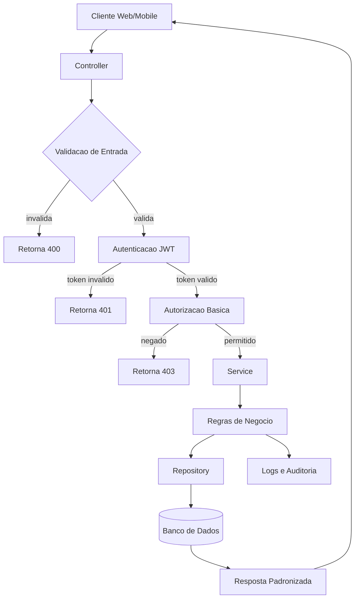

  

<h3 align="center">Backend Developer em formacao com foco em APIs, arquitetura de sistemas, modelagem e seguranca aplicada</h3>

  
  
  

---

## 1) Header

Construo APIs REST e servicos backend com foco em estrutura, consistencia e seguranca aplicada.

Como marca tecnica, **Cinco** representa backend, sistemas bem modelados e engenharia aplicada a problemas reais.

---

## 2) Sobre Mim

Sou **Adilson Junior (Cinco)**, em formacao voltada para backend. Meu foco principal e projetar e implementar APIs REST com Java/Spring Boot e Node.js.

O que eu construo:
- APIs para cadastro, autenticacao, consulta e regras de negocio.
- Estruturas de projeto organizadas por camadas.
- Fluxos com validacao de entrada, tratamento de erro e padrao de resposta.

Como eu construo:
- Modelagem de requisitos antes da implementacao.
- Separacao clara entre controller, service e repository.
- Versionamento com Git e documentacao de endpoints.

Que problemas eu resolvo:
- Sistemas sem padrao de arquitetura.
- APIs sem consistencia de contratos.
- Regras de negocio dispersas, com alto custo de manutencao.

---

## 3) Stack Tecnica por Camadas

### Backend

  
  
  

### Linguagens

  
  

### Infra e Ferramentas

  
  
  

### Frontend Basico

  
  

---

## 4) Engenharia de Software

- UML aplicada a sistemas reais: casos de uso, classes e sequencia.
- Modelagem de APIs REST com contratos claros de request/response.
- Arquitetura em camadas: Controller, Service e Repository.
- Boas praticas de codigo limpo: SOLID basico, separacao de responsabilidades e estrutura modular.
- Versionamento e organizacao de projetos para evolucao incremental.

---

## 5) Modelagem e Visualizacao com Mermaid

---

## 6) Seguranca Aplicada

- Validacao de entrada para reduzir risco de payload malformado.
- Autenticacao e autorizacao basica com JWT ou mecanismo equivalente.
- Testes de API com Postman cobrindo cenarios positivos e negativos.
- Consciencia das vulnerabilidades comuns do OWASP Top 10.

---

## 7) Roadmap Tecnico

- Construir APIs REST completas com Java/Spring Boot.
- Integrar bancos de dados relacionais e consultas estruturadas.
- Evoluir Spring Boot com DTOs, exceptions e organizacao de camadas.
- Aplicar Python em automacao e apoio a backend.
- Modelar sistemas reais com UML antes da implementacao.
- Aplicar seguranca basica em APIs desde a concepcao.

---

## 8) 🧪 Engineering Lab

### Backend APIs (Java / Spring Boot)
- Foco: construcao de APIs REST com camadas bem definidas.
- Evolucao: CRUD, validacao, tratamento de erro e estrutura de projeto.
- Estudo: controller, service, repository, DTOs e excecoes.

### Node.js APIs
- Foco: rotas REST e manipulacao de dados em backend simples.
- Evolucao: estrutura de endpoints, middlewares e organizacao de fluxo.
- Estudo: autenticacao basica, respostas padronizadas e integracao com dados.

### Python (Automacao e Estudos Aplicados)
- Foco: scripts para automacao e apoio a backend.
- Evolucao: processamento de dados, leitura de arquivos e tarefas repetitivas.
- Estudo: logica aplicada e produtividade tecnica.

### Modelagem de Sistemas (UML & Mermaid)
- Foco: diagramacao antes do codigo.
- Evolucao: fluxos, APIs, autenticacao e arquitetura backend.
- Estudo: estrutura de sistemas reais e representacao visual de requisitos.

### API Testing (Postman)
- Foco: teste de endpoints REST e validacao de respostas.
- Evolucao: cenarios positivos, negativos e de seguranca basica.
- Estudo: contratos de API, status code e consistencia de retorno.

### Status
- Todos os itens representam pratica ativa de engenharia de software em evolucao continua.

---

## 9) GitHub Stats - Technical Dashboard

  
  
  

  

---

## 10) Mindset de Engenharia

- Software deve ser tratado como sistema estruturado.
- Seguranca deve fazer parte da arquitetura.
- Codigo limpo deve ser padrao, nao excecao.
- Sistemas devem ser previsiveis, escalaveis e mantiveis.
- O objetivo e resolver problemas reais com engenharia.

---

## 11) Contato

  
  
  

---

## 12) Assinatura

**Cinco - construindo sistemas com logica, estrutura e seguranca aplicada.**
