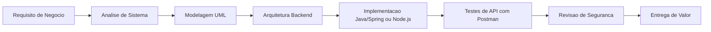

  

<h3 align="center">Desenvolvedor em formacao avancada com foco em backend, engenharia de software e seguranca</h3>

  Transformo logica, arquitetura e visao de negocio em sistemas seguros, escalaveis e orientados a impacto.

  
  

---

## Sobre mim

Sou Junior (Adilson Junior), tambem conhecido como Cinco. Estou evoluindo como profissional hibrido entre desenvolvimento, engenharia de software, seguranca da informacao e analise de negocios.

Minha trilha combina construcao tecnica com pensamento sistemico: backend e web para entrega, arquitetura e modelagem para consistencia, cybersecurity para resiliencia e analise de sistemas para alinhamento com o negocio.

Estudo ethical hacking com foco etico, defensivo e ofensivo controlado para entender vulnerabilidades e projetar solucoes mais seguras desde a base.

---

## Stack Tecnologica

  
  
  
  
  
  
  
  
  
  
  

---

## Modelagem e Engenharia de Software

- UML aplicada a casos de uso, classes e sequencia.
- Modelagem de sistemas para clareza de regras e fluxos.
- Arquitetura de software com foco em modularidade e escalabilidade.
- Boas praticas: separacao de responsabilidades, padroes de projeto e versionamento limpo.

---

## Visualizacao de Sistemas com Mermaid

Utilizo Mermaid.js para representar fluxos, arquitetura e processos de negocio de forma clara e auditavel.

---

## Foco Atual (Roadmap de Estudos)

- Backend com Java e Spring Boot.
- Python para automacao e scripts tecnicos.
- Estruturacao de APIs REST e testes com Postman.
- Modelagem de sistemas com UML e diagramacao com Mermaid.
- Seguranca da informacao com fundamentos de ethical hacking.
- Analise de requisitos e processos de negocio orientados a tecnologia.

---

## Perfil Profissional Hibrido

Atuo em formacao como um perfil que conecta tecnologia e estrategia:

- Desenvolvedor backend para construir servicos consistentes.
- Analista de sistemas e negocios para mapear necessidades reais.
- Estudante de engenharia de software para desenhar solidez arquitetural.
- Entusiasta de cybersecurity para aumentar resiliencia e confiabilidade.

Objetivo central: construir sistemas seguros, bem estruturados e escalaveis.

---

## Projetos (Estrutura Futura)

### APIs Backend (Java / Spring Boot / Node.js)
- Projeto:
- Problema que resolve:
- Stack:
- Link:

### Scripts Python (Automacao e Analise)
- Projeto:
- Automacao aplicada:
- Insight tecnico:
- Link:

### Seguranca e Testes de API
- Projeto:
- Escopo de seguranca/testes:
- Ferramentas:
- Link:

### Modelagem de Sistemas (UML e Mermaid)
- Projeto:
- Diagramas produzidos:
- Decisoes de arquitetura:
- Link:

### Projetos Academicos e Portfolio
- Projeto:
- Contexto:
- Entregaveis:
- Link:

---

## 📊 GitHub Stats

## 🐍 Contribution Snake

---

## Mindset Profissional

- Pensamento analitico e sistemico para resolver problemas complexos.
- Seguranca como fundamento tecnico de qualquer sistema serio.
- Visao de negocio aplicada a decisoes de arquitetura e produto.
- Evolucao continua com estudo disciplinado e pratica real.
- Compromisso com solucoes escalaveis, legiveis e sustentaveis.

---

## Contato

  
  
  

---

> Cinco: engenharia com logica, seguranca por principio, sistemas com proposito.

